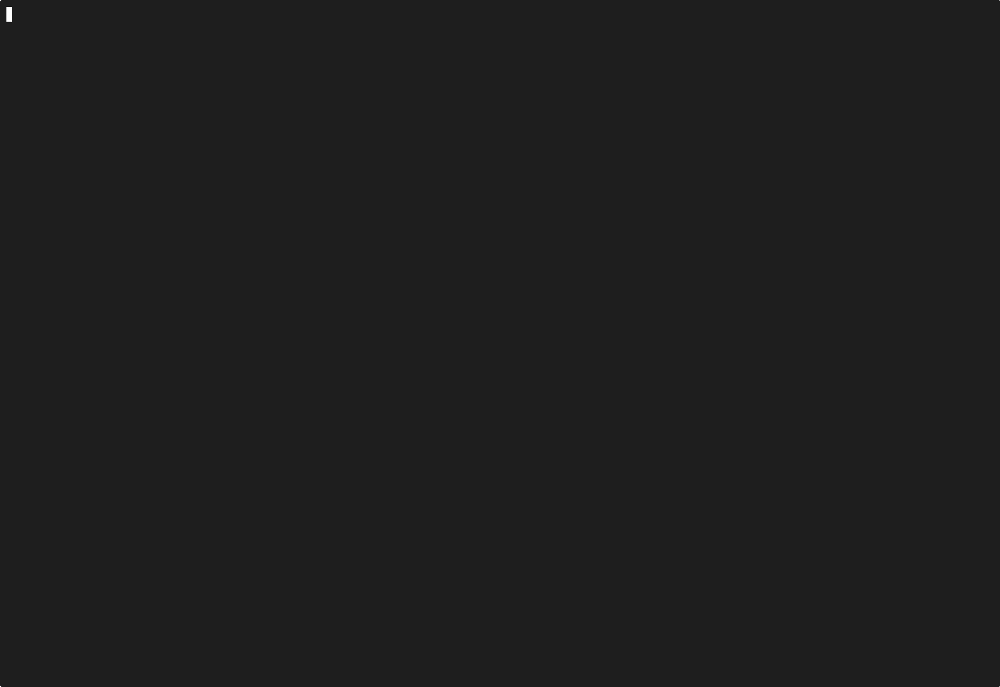

# DebtDrone CLI

**Stop counting lines. Start fixing debt.**

[](https://opensource.org/licenses/MIT)
[](https://go.dev/)
[](https://github.com/endrilickollari/debtdrone-cli/releases)

<div align="center">
  
  <p><em>Scanning a complex repo in <200ms</em></p>
</div>

---

## Why DebtDrone?

Traditional linters check **style**. DebtDrone analyzes **architecture**.

Most code quality tools rely on regex pattern matching—they're fast but fragile. A complex function signature with nested generics? False positive. A callback wrapped in middleware? Missed entirely.

**DebtDrone uses Abstract Syntax Trees (AST)** via Tree-sitter, the same technology that powers GitHub's code navigation. It understands your code the way a compiler does: parsing structure, not strings. This means:

- ✅ **Zero false positives** on complex type signatures
- ✅ **Context-aware analysis** of function complexity
- ✅ **Multi-language support** with high accuracy

If your linter is guessing, you're not measuring debt—you're measuring noise.

---

## 🎯 Key Features

- **🌳 True AST Analysis**  
  Deep parsing for Go, Python, JavaScript/TypeScript, Java, and Rust. Not regex. Not heuristics.

- **🔒 Security Built-In**  
  Detects hardcoded secrets, API keys, and CVEs via integrated Trivy scanning.

- **🏠 Privacy First**  
  Runs 100% locally. In-memory processing. Zero database. Your source code never leaves your machine.

- **⚙️ CI/CD Ready**  
  Returns exit code `1` on critical issues. Break builds on high debt. Enforce standards automatically.

- **⚡ Blazing Fast**  
  Written in Go. Scans large repositories in milliseconds.

---

## 📦 Installation

### via Homebrew (Recommended for macOS & Linux)

```bash
brew install endrilickollari/tap/debtdrone
```

### via Shell Script (Linux & macOS)

```bash
curl -sL https://raw.githubusercontent.com/endrilickollari/debtdrone-cli/main/installation_scripts/install.sh | bash
```

### via PowerShell (Windows)

```powershell
iwr -useb https://raw.githubusercontent.com/endrilickollari/debtdrone-cli/main/installation_scripts/install.ps1 | iex
```

### Manual Download

Download pre-compiled binaries from the [Releases Page](https://github.com/endrilickollari/debtdrone-cli/releases).

---

## 🛠️ Build from Source

**Prerequisites:**

- Go 1.22+
- C Compiler (gcc/clang) - _Required for Tree-sitter engine_

```bash
git clone https://github.com/endrilickollari/debtdrone-cli.git
cd debtdrone-cli
go build -o debtdrone ./cmd/debtdrone
./debtdrone -version
```

---

## 🚀 Usage

### Basic Scan

Run inside your project root:

```bash
debtdrone
```

Or specify a path:

```bash
debtdrone ./src/my-project
```

### CI/CD Pipeline

Fail the build if critical issues are found:

```bash
debtdrone -path . -fail-on critical
```

### JSON Output

Generate a report for other tools:

```bash
debtdrone -output json > report.json
```

---

## 🤖 AI-Powered Fixes (Cloud)

**DebtDrone CLI finds the issues. DebtDrone Cloud fixes them.**

Connect to **DebtDrone Cloud** (Launching Soon) to auto-fix issues with AI, track historical trends, and manage team access.

---

## 📄 License

DebtDrone CLI is distributed under the **MIT License**. Free to use, modify, and distribute.

See [LICENSE](https://github.com/endrilickollari/debtdrone-cli/blob/main/LICENSE) for full details.

---

## 🤝 Contributing

This repository serves as the **public distribution channel** for DebtDrone CLI. The source code is proprietary, but we welcome:

- 🐛 Bug reports
- 💡 Feature requests
- 📖 Documentation improvements

**Read our [Contributing Guide](CONTRIBUTING.md)** to get started.

### Quick Links

- 📖 [Contributing Guidelines](CONTRIBUTING.md) - How to contribute
- 🔨 [Build Guide](BUILD.md) - Build system and release process
- 📋 [Issues](https://github.com/endrilickollari/debtdrone-cli/issues) - Report bugs or request features

---

<div align="center">

**Built with ❤️.**

</div>
