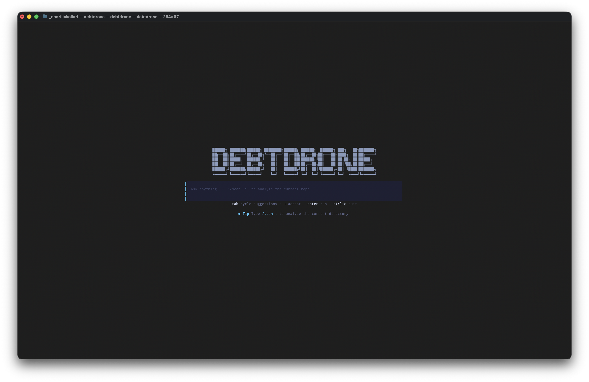
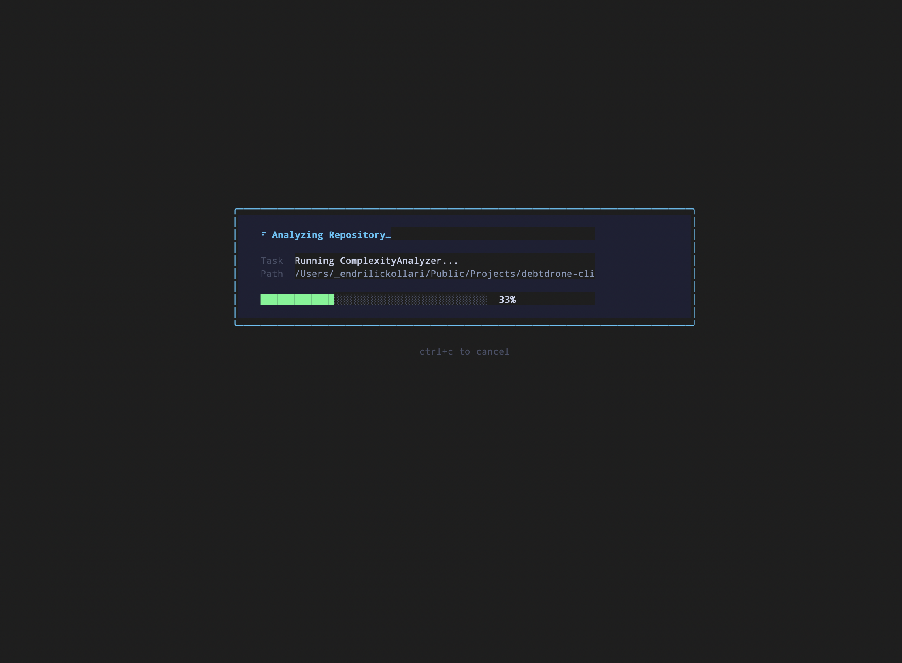
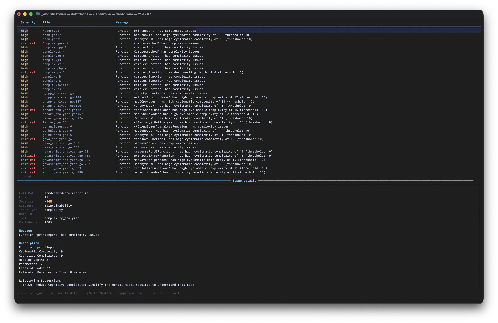
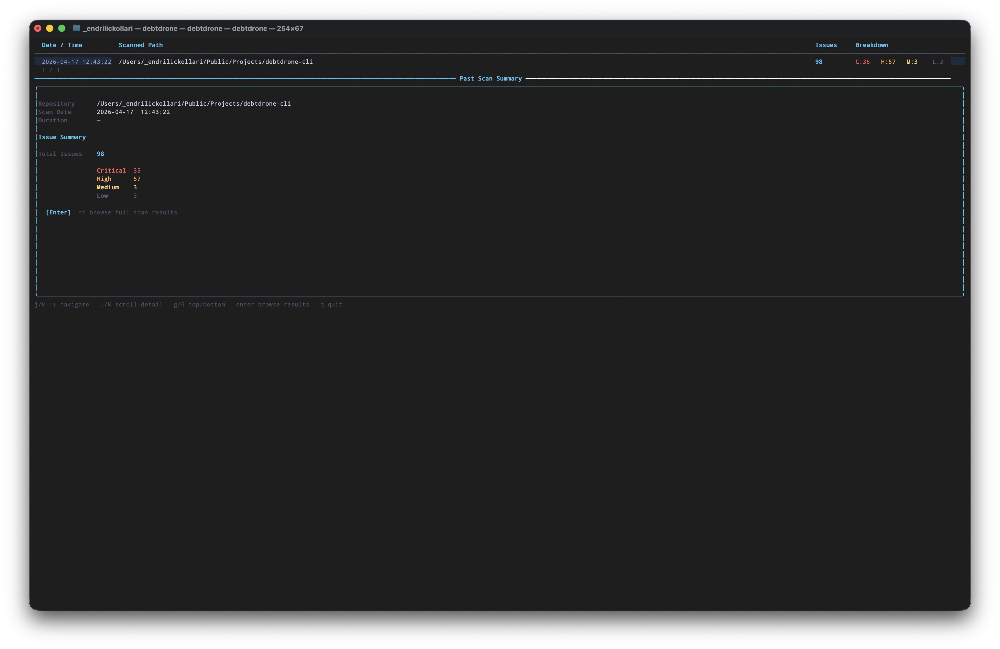
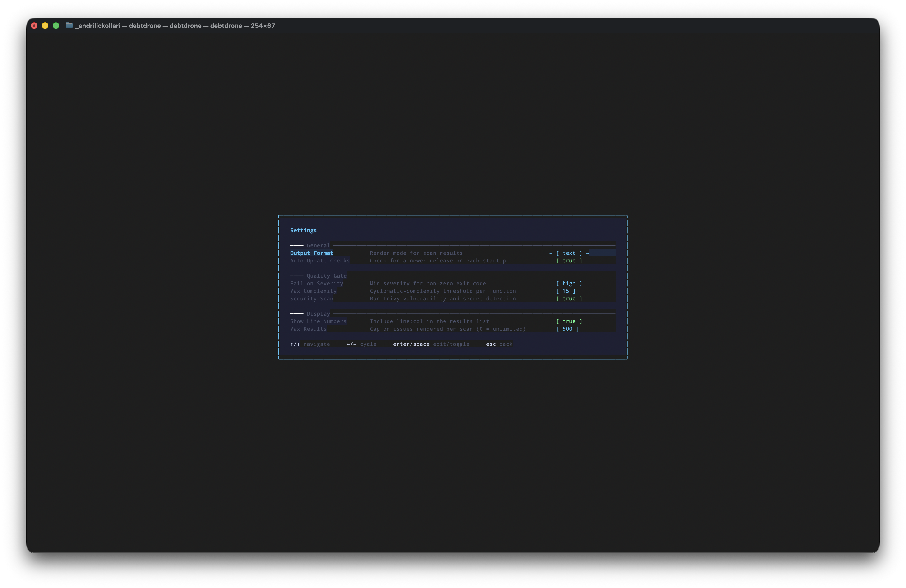

# Interactive TUI Explorer

The DebtDrone TUI is a full-screen terminal application built with [Bubble Tea v2](https://github.com/charmbracelet/bubbletea) and styled with [Lipgloss](https://github.com/charmbracelet/lipgloss). It is designed for the exploratory half of the workflow: understanding a codebase, spotting trends across scan history, and adjusting analysis settings — all without leaving the terminal.

---

## Launching the TUI

Type `debtdrone` with no arguments:

```bash
debtdrone
```

The application opens to a centered **command bar** beneath the DebtDrone ASCII logo. Type `/` to begin a command, or press `Tab` to cycle through suggestions.


*The TUI welcome screen. The command bar accepts slash-prefixed commands and offers tab-completion.*

!!! note "Directory context"
    The TUI targets the directory from which it is launched. Run it from your repository root for the most accurate results.

---

## Navigation

DebtDrone uses familiar Vim-style keybindings throughout every view.

| Key | Action |
|---|---|
| `j` / `↓` | Move selection down |
| `k` / `↑` | Move selection up |
| `Enter` | Confirm selection / drill into detail |
| `Esc` | Go back to the previous view / cancel |
| `Tab` | Cycle through completions in the command bar |
| `q` | Quit the application from the menu |
| `?` | Toggle the help overlay |

These bindings are consistent across all child views (scan results, history browser, config editor). There is no mode-switching; `Esc` always returns you to the previous context.

---

## The Command Bar

When the TUI opens, you land on the command bar. Type `/` to begin a command. The bar offers tab-completion and shows a description of each command as you navigate.

Available commands:

| Command | Description |
|---|---|
| `/scan` | Analyze the current directory for technical debt |
| `/history` | Browse all previous scan runs |
| `/config` | Open the interactive settings editor |
| `/update` | Check for a new DebtDrone release |
| `/help` | Show the full keybindings reference |
| `/quit` | Exit the application |

---

## `/scan` — Analyzing Your Codebase

```
/scan
```

Pressing `Enter` on `/scan` triggers the analysis engine. The view transitions through two phases:

### Phase 1 — Scanning

A focused progress panel appears at the center of the screen. It shows the name of the currently-running analyzer, the path being processed, and a live progress bar so you always know how far along the scan is. Press `Ctrl+C` to cancel at any time.


*The scan progress panel mid-run. The active task (`ComplexityAnalyzer`) and the scanned path update in real time.*

!!! tip "What gets scanned?"
    DebtDrone analyzes 14 languages: Go, JavaScript, TypeScript (including JSX/TSX), Python, Java, C#, PHP, Ruby, Rust, Kotlin, Swift, C, and C++. Files in `node_modules`, `vendor`, `dist`, and `.git` are excluded by default.

### Phase 2 — Results (Master-Detail Layout)

Once scanning completes, the view expands into a full master-detail layout.

- **Top pane (Master):** A scrollable list of all flagged files and functions, colour-coded by severity (`critical` in red, `high` in orange, `medium` in yellow, `low` in blue). Use `j`/`k` to navigate.
- **Bottom pane (Detail):** The full breakdown for the selected item, including:
    - All computed metrics (Cyclomatic Complexity, Cognitive Complexity, Nesting Depth, Parameters, LOC)
    - Severity rating and estimated **debt in minutes** — a concrete number for sprint planning
    - Actionable **Refactoring Suggestions** generated from the specific violation


*The results view. The top pane lists every finding by severity; the bottom pane shows the full metric breakdown and refactoring suggestions for the selected function.*

Press `Esc` to return to the command bar. Scan results are automatically persisted to history.

---

## `/history` — Browsing Past Scans

```
/history
```

The history view lists every scan DebtDrone has previously run, ordered by date. The header bar shows each entry's timestamp, scanned path, total issue count, and a severity breakdown (`C` / `H` / `M` / `L`). Selecting an entry opens a **Past Scan Summary** panel showing the full issue breakdown before you drill further.


*The history browser. The selected entry shows 98 total issues: 35 critical, 57 high, 3 medium, 3 low. Press `Enter` to open the full results view for that run.*

Select any entry with `Enter` to open it in the same master-detail layout used by the live scan view. Use this to compare a refactored function across two points in time or to demonstrate debt reduction to your team.

!!! tip "Spotting trends"
    Run a scan before and after a refactoring sprint. Use `/history` to compare the two runs side-by-side and quantify the improvement in debt minutes eliminated.

---

## `/config` — Interactive Settings Editor

```
/config
```

The config view presents all configurable DebtDrone settings as a navigable form, organised into three sections: **General**, **Quality Gate**, and **Display**. Each item shows its current value inline and accepts edits without leaving the terminal.


*The Settings editor. Navigate with `j`/`k`, cycle enum values with `←`/`→`, and toggle booleans with `Enter` or `Space`.*

| Section | Setting | Description |
|---|---|---|
| **General** | Output Format | `text` or `json` — affects headless CLI output |
| **General** | Auto-Update Checks | Check for a newer release on each startup |
| **Quality Gate** | Fail on Severity | CI exit-1 threshold (`low` / `medium` / `high` / `critical` / `none`) |
| **Quality Gate** | Max Complexity | Cyclomatic complexity threshold per function (default: `15`) |
| **Quality Gate** | Security Scan | Run Trivy vulnerability and secret detection |
| **Display** | Show Line Numbers | Include line numbers in the results list |
| **Display** | Max Results | Cap on issues rendered per scan (`0` = unlimited) |

### Editing a Value

1. Navigate to the setting with `j`/`k`.
2. Press `Enter` to enter edit mode.
3. For **boolean** settings, `Enter` or `Space` toggles the value directly.
4. For **enum** settings (like Output Format), use `←`/`→` to cycle through valid values and `Enter` to confirm.
5. For **integer** settings, type the new value and press `Enter`.
6. Press `Esc` to cancel an edit without saving.

Changes are written to your `.debtdrone.yaml` file immediately.

---

## `/update` — Self-Updater

```
/update
```

The update view connects to the GitHub Releases API, compares the current binary version against the latest published release, and presents the result.

- If you are **up to date**, a confirmation message is shown.
- If a **new version is available**, the release notes and changelog are displayed inline. Press `Enter` to download and apply the update in-place. The binary replaces itself and the new version is active on the next launch.

!!! warning "Permissions"
    The updater writes to the same path as the running binary. If DebtDrone was installed in a system directory (e.g., `/usr/local/bin`), you may need to run it with `sudo` or reinstall via Homebrew to apply updates.
