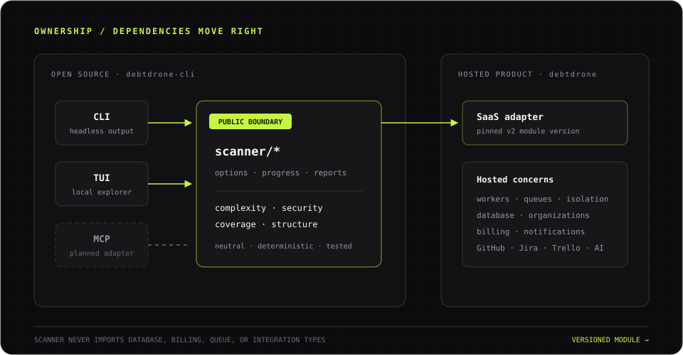

DebtDrone has four consumers of one reusable scanner: the headless CLI, the
TUI, the local MCP server, and the DebtDrone SaaS adapter. The public `scanner`
packages are the stable boundary; the `internal` packages are implementation
details and cannot be imported by other Go modules.

Read [Scanner ownership and contribution boundary](../ownership/) before making
a change that also affects the SaaS.


*The reusable scanner flows into both products; hosted product concerns never flow back into the scanner.*

## Dependency direction

```text
cmd/debtdrone ──> internal/service ──> scanner
cmd/debtdrone ──> internal/mcpserver ─> scanner
internal/tui  ──> internal/service ──> scanner
debtdrone SaaS adapter ──────────────> scanner (version pinned in SaaS go.mod)

scanner ──> internal/scancore + internal analyzers/file policy
scanner -X-> CLI, TUI, MCP, SaaS, database, Redis, queues, billing, integrations
```

The final arrow is enforced by external-consumer and dependency-boundary tests.
Consumers configure a scan through neutral options and receive a neutral,
deterministically ordered report.

## Public scanner packages

| Package | Responsibility |
|---|---|
| `scanner` | Scan entry point, scope, analyzer options, progress, failures, report contract |
| `scanner/coverage` | Coverage artifact types, parsers, and optional execution interface |
| `scanner/repostructure` | Repository layout, build-root, and build-enrichment detection |

`scanner.Scan` accepts a context, repository path, and `scanner.Options`.
Callers choose full, incremental, or explicit no-change scope. Cancellation and
partial analyzer failures are part of the public contract; callers must not
infer them from logs.

## Internal implementation

- `internal/analysis/analyzers` contains complexity, line-count, and Trivy
  implementations registered with the scanner runner.
- `internal/filepolicy` centralizes safe file inclusion/exclusion behavior.
- `internal/scancore` contains internal analyzer contracts shared by the public
  runner and implementations.
- `internal/service` adapts public scanner reports for local CLI/TUI history and
  presentation.
- `internal/mcpserver` adapts the public scanner report to the local,
  root-confined MCP tool contract.
- `internal/store/memory` provides local ephemeral persistence.
- `internal/git`, `internal/config`, and `internal/update` are CLI support code.
- `internal/tui` is the Bubble Tea presentation adapter.

Internal types may change without a module API promise. Types needed by an
external consumer must be deliberately modeled in `scanner`, documented, and
covered by compatibility tests.

## SaaS integration

The SaaS imports an immutable `debtdrone-cli/v2` module version and adapts the
report to its own database models. It owns queueing, hosted cloning, isolated
Docker execution, persistence, reconciliation, history, and commercial
features. The scanner remains unaware of those systems.

Scanner changes land and are released here first. The SaaS then receives a
reviewable dependency-only pull request and runs Linux, macOS, and Windows
boundary tests before adoption. A SaaS rollback restores its previous
application revision and scanner pin; it never switches to a copied engine.

The local MCP server is another adapter over this same public scanner boundary.
It exposes a read-only `scan_repository` tool over stdio and confines tool
paths to an explicit root. See [MCP and coding agents](../mcp-and-agents/) for
client setup, the tool contract, and its trust boundary.
