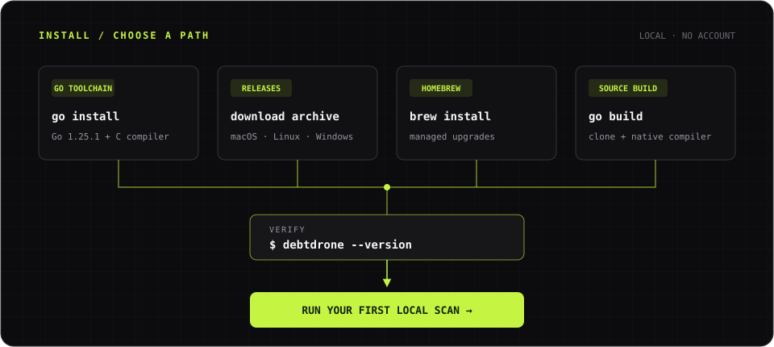

DebtDrone ships as a single binary. Core local scanning needs no companion service; [Trivy](https://trivy.dev/) is required only when security scanning is enabled. Choose the installation method that best fits your workflow.


*Choose a package manager, release archive, or source build; every path ends with the same local verification.*

---

## Option 1 — `go install`

If you have Go 1.25.1 or later and a C compiler on your `PATH`, this is the fastest path to a working installation:

```bash title="Terminal · Install with Go"
go install github.com/endrilickollari/debtdrone-cli/v2/cmd/debtdrone@latest
```

The binary is placed in `$(go env GOPATH)/bin`. Ensure that directory is on your `PATH`:

```bash title="Terminal · Add the Go bin directory"
export PATH="$PATH:$(go env GOPATH)/bin"
```

Verify the installation:

```bash title="Terminal · Verify the binary"
debtdrone --version
```

---

## Option 2 — Pre-compiled Binaries

Pre-compiled binaries are published to the [GitHub Releases](https://github.com/endrilickollari/debtdrone-cli/releases/latest) page for every tagged release. Download the archive for your platform, extract it, and place the binary somewhere on your `PATH`.

### Supported Platforms

| OS | Architecture | Archive |
|---|---|---|
| macOS | x86_64 (Intel) | `debtdrone_Darwin_x86_64.tar.gz` |
| macOS | arm64 (Apple Silicon) | `debtdrone_Darwin_arm64.tar.gz` |
| Linux | x86_64 | `debtdrone_Linux_x86_64.tar.gz` |
| Linux | arm64 | `debtdrone_Linux_arm64.tar.gz` |
| Windows | x86_64 | `debtdrone_Windows_x86_64.zip` |

:::note[Windows ARM64]
Windows ARM64 is not currently supported in the pre-compiled release artifacts. Windows ARM64 users should build from source (see below).
:::

### macOS / Linux

```bash title="Terminal · Install a macOS release archive"
# Replace <version> and <platform> with the values for your system
# Example: debtdrone_Darwin_arm64.tar.gz for Apple Silicon
curl -L https://github.com/endrilickollari/debtdrone-cli/releases/latest/download/debtdrone_Darwin_arm64.tar.gz \
  | tar -xz -C /usr/local/bin

debtdrone --version
```

### Windows (PowerShell)

```powershell title="PowerShell · Install a Windows release archive"
# Download and extract
Invoke-WebRequest -Uri "https://github.com/endrilickollari/debtdrone-cli/releases/latest/download/debtdrone_Windows_x86_64.zip" `
  -OutFile debtdrone.zip
Expand-Archive -Path debtdrone.zip -DestinationPath "$env:LOCALAPPDATA\debtdrone"

# Add to PATH for the current session
$env:PATH += ";$env:LOCALAPPDATA\debtdrone"
```

---

## Option 3 — Homebrew (macOS & Linux)

DebtDrone is published to a [Homebrew tap](https://github.com/endrilickollari/homebrew-tap):

```bash title="Terminal · Install with Homebrew"
brew tap endrilickollari/tap
brew install debtdrone
```

Upgrade to the latest release at any time:

```bash title="Terminal · Upgrade with Homebrew"
brew upgrade debtdrone
```

---

## Option 4 — Build from Source

Clone the repository and build with the standard Go toolchain:

```bash title="Terminal · Build from source"
git clone https://github.com/endrilickollari/debtdrone-cli.git
cd debtdrone-cli
go build -o debtdrone ./cmd/debtdrone
sudo mv debtdrone /usr/local/bin/
```

:::note[CGO requirement]
The analysis engine uses [tree-sitter](https://tree-sitter.github.io/tree-sitter/) for multi-language syntax parsing, which requires CGO. Ensure a C compiler (`gcc` or `clang`) is present on your system before building from source.
:::

---

## Built-in Auto-Updater

:::tip[Install once, stay current automatically]
DebtDrone ships with a built-in self-updater. Launch the TUI and use `/update`
to check for a release, review its notes, and apply it in place. There is no
headless `debtdrone update` subcommand in the current release.
:::

---

## Verifying the Installation

Run the following to confirm everything is working:

```bash title="Terminal · Verify and scan"
# Show version information
debtdrone --version

# Run a quick scan of the current directory
debtdrone scan . --format=text
```

If you see version output and a scan report, you are ready to go.

Continue with [Run your first scan](../quickstart/). If installation or native
compilation fails, use the [troubleshooting guide](../troubleshooting/).
