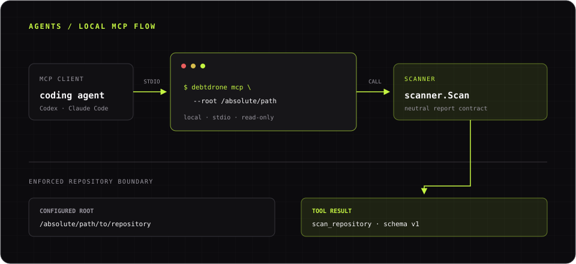

DebtDrone exposes its scanner to supported coding agents through a local
[Model Context Protocol (MCP)](https://modelcontextprotocol.io/) server. The
agent starts `debtdrone` as a stdio process and can call one read-only tool,
`scan_repository`, within a repository root that you choose.


*The agent and DebtDrone communicate over local stdio. Every tool path remains inside the configured root.*

## Before you connect an agent

:::note[MCP release availability]
The `mcp` command is available on `main` but is not included in the latest
tagged release, `v2.1.0`. Until the next approved release is published, install
the current source version:

```bash title="Terminal · Install MCP support from main"
go install github.com/endrilickollari/debtdrone-cli/v2/cmd/debtdrone@main
```

The same `go install` command works in PowerShell.

This requires the Go and C compiler prerequisites described in
[Install the CLI](../installation/). Return to the normal tagged installation
methods after a release containing `debtdrone mcp` is available.
:::

Confirm that the installed binary exposes the MCP command and is discoverable
from your shell:

```bash title="Terminal · Verify the MCP command"
debtdrone --version
debtdrone mcp --help
command -v debtdrone
```

On Windows PowerShell, use:

```powershell title="PowerShell · Verify the MCP command"
debtdrone --version
debtdrone mcp --help
(Get-Command debtdrone).Source
```

Choose the narrowest directory the agent needs to scan and resolve it to an
absolute path. Replace `/absolute/path/to/repository` in the examples below
with that path. Windows examples use forward slashes so paths work in client
configuration files without JSON escaping.

:::caution[The root is a trust boundary]
Do not use your home directory or a broad workspace as the root. DebtDrone can
read supported files below this directory, and findings or source snippets may
be sent by the MCP client to its model provider.
:::

## Connect Codex

Add DebtDrone as a local stdio server:

```bash title="Terminal · Add DebtDrone to Codex"
codex mcp add debtdrone -- \
  debtdrone mcp --root /absolute/path/to/repository
```

On Windows PowerShell, enter the same configuration on one line:

```powershell title="PowerShell · Add DebtDrone to Codex"
codex mcp add debtdrone -- debtdrone mcp --root C:/path/to/repository
```

Codex stores MCP settings in `~/.codex/config.toml`, as described in the
[Codex MCP configuration guide](https://developers.openai.com/codex/mcp). The
equivalent manual configuration is:

```toml title="~/.codex/config.toml"
[mcp_servers.debtdrone]
command = "/absolute/path/to/debtdrone"
args = ["mcp", "--root", "/absolute/path/to/repository"]
```

Use the full executable path reported by `command -v debtdrone` if the Codex
process does not inherit your shell `PATH`. You can instead use a trusted
project-level `.codex/config.toml`, but an absolute repository path is normally
better kept in your user configuration. On Windows, use the path reported by
`(Get-Command debtdrone).Source` and write it with forward slashes, such as
`C:/Users/you/bin/debtdrone.exe`.

Verify the registration with `codex mcp list`. In an active Codex session, use
`/mcp` to confirm that the `debtdrone` server is connected and exposes
`scan_repository`.

## Connect Claude Code

Add DebtDrone to the current project using Claude Code's local scope:

```bash title="Terminal · Add DebtDrone to Claude Code"
claude mcp add --transport stdio --scope local debtdrone -- \
  debtdrone mcp --root /absolute/path/to/repository
```

On Windows PowerShell, use:

```powershell title="PowerShell · Add DebtDrone to Claude Code"
claude mcp add --transport stdio --scope local debtdrone -- debtdrone mcp --root C:/path/to/repository
```

The equivalent project-scoped `.mcp.json` entry follows the
[Claude Code MCP configuration](https://code.claude.com/docs/en/mcp):

```json title=".mcp.json"
{
  "mcpServers": {
    "debtdrone": {
      "type": "stdio",
      "command": "/absolute/path/to/debtdrone",
      "args": ["mcp", "--root", "/absolute/path/to/repository"]
    }
  }
}
```

Prefer local scope for a machine-specific absolute path. If you share
`.mcp.json`, every contributor must review and approve the server before using
it and must adapt the executable and root paths for their machine.

Verify the registration with `claude mcp list`. In Claude Code, use `/mcp` to
check the connection and available tool.

## Verify a scan from the agent

Restart or reload the coding agent after changing its configuration, then send
this request. Here, `.` means the configured MCP root, not the agent's working
directory:

```text title="Agent request · Safe first scan"
Use DebtDrone's scan_repository tool to scan path "." with
security_scan set to false and max_findings set to 50. Summarize the highest
severity findings and tell me whether the result is complete or partial.
```

The tool result uses the schema version `debtdrone.scan_repository/v1`. A
successful response includes `status`, `repository`, `findings`, `warnings`,
`failures`, and response-limit metadata. `status: partial` means at least one
analyzer failed while other results remained available.

## `scan_repository` inputs

| Input | Default | Description |
|---|---:|---|
| `path` | `.` | Repository path relative to the configured MCP root |
| `max_complexity` | `15` | Cyclomatic-complexity threshold; accepts `1` through `10000` |
| `security_scan` | `true` | Run the optional Trivy security analyzer |
| `coverage` | `false` | Parse existing coverage artifacts without executing tests |
| `max_findings` | `200` | Maximum returned findings; accepts `1` through `1000` |

Absolute tool paths, parent traversal, and symlinks that resolve outside the
configured root are rejected. A server runs at most one scan at a time, so a
second request waits until the first scan finishes or the client cancels it.

## Security and privacy

- The server is a local stdio process. It does not open a network listener,
  authenticate to DebtDrone SaaS, or persist results there.
- `scan_repository` is read-only, idempotent, and non-destructive to the target
  repository. The configured root is canonicalized before the server starts.
- The MCP client controls what result content is sent to its model provider.
  Review that client's data policy before scanning private source code.
- Security scanning is enabled by default. It invokes a locally installed
  Trivy executable, which may access the network to update its vulnerability
  database and may write to its own cache. Set `security_scan` to `false` for a
  predictable offline first scan.
- Coverage mode only reads supported artifacts already in the repository.
  DebtDrone does not execute repository tests through MCP.
- Treat repository content as untrusted input. DebtDrone reports findings; the
  coding agent remains responsible for deciding whether to take later actions.

SaaS persistence, billing, integrations, notifications, and hosted execution
remain outside the CLI scanner. See [System architecture](../architecture/)
and [Scanner ownership](../ownership/) for that boundary.

## Troubleshoot the connection

### The client cannot find `debtdrone`

GUI-launched clients often inherit a different `PATH` from interactive
shells. On macOS or Linux, run `command -v debtdrone` and place the returned
absolute path in the client's `command` setting. Also confirm the executable
bit and version:

```bash
ls -l /absolute/path/to/debtdrone
/absolute/path/to/debtdrone --version
```

On Windows PowerShell, inspect and run the discovered executable:

```powershell
$DebtDrone = (Get-Command debtdrone).Source
Get-Item $DebtDrone
& $DebtDrone --version
```

### The root is missing, invalid, or unreadable

`--root` is required and must point to an existing directory. Confirm the
directory and its permissions outside the client:

```bash
test -d /absolute/path/to/repository
test -r /absolute/path/to/repository
test -x /absolute/path/to/repository
debtdrone mcp --root /absolute/path/to/repository
```

On Windows PowerShell, verify that the root is a directory and start the same
server command:

```powershell
Test-Path C:/path/to/repository -PathType Container
debtdrone mcp --root C:/path/to/repository
```

The last command normally appears idle because the server is waiting for MCP
messages on stdin. Press `Ctrl+C` to stop it. A later tool call can still report
a permission error for an unreadable file below the root.

### The client reports a protocol or startup failure

Configure the transport as `stdio`, the command as the DebtDrone executable,
and each argument as a separate item. Do not configure an HTTP URL and do not
wrap the command in a script that prints banners or logs to stdout. MCP reserves
stdout for JSON-RPC protocol messages.

Run `debtdrone mcp --help` to catch an unsupported release or malformed flag,
then inspect `codex mcp list`, `claude mcp list`, or the client's `/mcp` panel.
Restart the client after correcting the configuration.

### Diagnostics appear on stderr

Stderr is the diagnostic channel; stdout must remain protocol-only. Inspect the
client's MCP logs for startup errors, but never merge stderr into stdout with
`2>&1`. Analyzer warnings and partial failures returned by a scan are also
available in the tool result's `warnings` and `failures` fields.

### A scan is slow, times out, or returns partial results

Only one scan runs per server. Wait for the current request to finish, reduce
the target with `path`, or retry with `security_scan: false` to isolate Trivy.
If the client enforces a short tool timeout, increase it only after confirming
the configured root is appropriately narrow. Inspect `warnings`, `failures`,
and `truncated` before assuming the response is complete.

For non-MCP installation and analyzer failures, continue with the general
[troubleshooting guide](../troubleshooting/).
