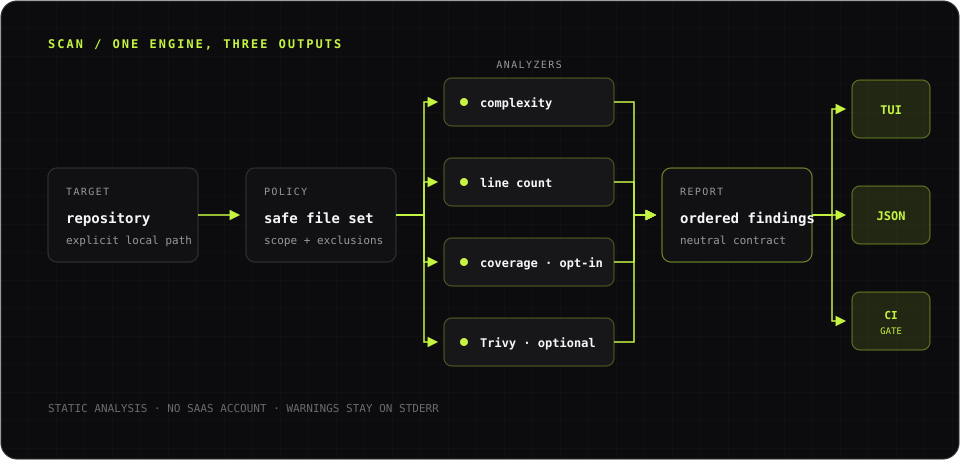

This tutorial takes you from installation to a useful local scan. It disables
the optional Trivy analyzer for the first run so the result does not depend on
another executable.


*One scanner pipeline powers interactive exploration, JSON output, and CI quality gates.*

## 1. Install DebtDrone

If you already have Go 1.25.1 or later and a C compiler, install the latest CLI release:

```bash title="Terminal · Install DebtDrone"
go install github.com/endrilickollari/debtdrone-cli/v2/cmd/debtdrone@latest
```

Confirm that the binary is available:

```bash title="Terminal · Check the installed version"
debtdrone --version
```

If the command is not found, add `$(go env GOPATH)/bin` to your `PATH` or use
one of the alternatives in [Install the CLI](../installation/).

## 2. Open a repository

Change into a repository you want to inspect:

```bash title="Terminal · Enter a repository"
cd /path/to/your/repository
```

DebtDrone accepts an explicit directory, but running it from the repository
root makes paths and output easier to read.

## 3. Run a predictable first scan

Run the headless scanner with text output and security scanning disabled:

```bash title="Terminal · Run the first scan"
debtdrone scan . --format=text --security-scan=false
```

A repository with findings prints a table:

```text title="Example · Findings table"
SEVERITY   FILE:LINE                     RULE   MESSAGE
--------   ---------                     ----   -------
HIGH       /workspace/src/service.go:42  N/A    Function 'Run' has high cyclomatic complexity of 18 (threshold: 15)
```

A repository without findings prints:

```text title="Example · No findings"
No technical debt issues found.
```

Findings alone do not make this command fail. DebtDrone returns a quality-gate
error only when you explicitly provide `--fail-on`.

## 4. Inspect machine-readable output

Run the same scan as JSON:

```bash title="Terminal · Produce JSON"
debtdrone scan . --format=json --security-scan=false
```

Stdout is a JSON array of findings. This makes the command suitable for shell
scripts and agents. Analyzer warnings are written to stderr so they do not
corrupt the JSON document.

## 5. Add a quality gate

Fail the command when a `high` or `critical` finding is present:

```bash title="Terminal · Enforce a quality gate"
debtdrone scan . --fail-on=high --security-scan=false
```

Use this form in CI only after reviewing the repository's current findings.
Starting with a threshold that already fails can block every change rather
than preventing new debt.

## 6. Explore interactively

Launch the terminal interface from the same directory:

```bash title="Terminal · Open the TUI"
debtdrone
```

Enter `/scan` to scan the current directory, use `j` and `k` to move through
findings, and press `Esc` to return to the dashboard. See the
[Interactive TUI guide](../tui-usage/) for the complete workflow.

## Next steps

- [Run scans in CI/CD](../headless-usage/) and retain JSON reports as artifacts.
- [Configure scans](../configuration/) with explicit CLI flags.
- Enable Trivy after following its official installation instructions.
- Consult the [command reference](../command-reference/) for every current command and flag.
