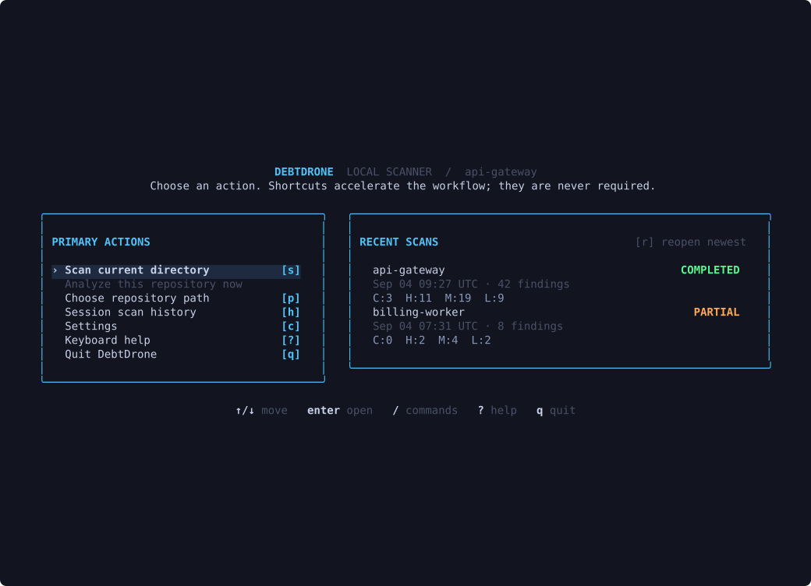
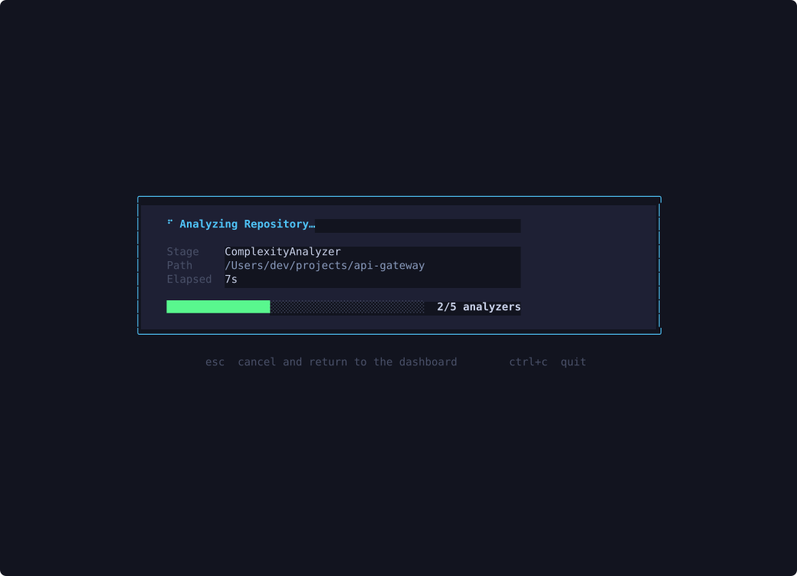
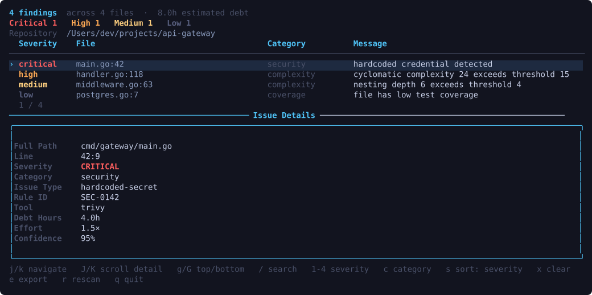
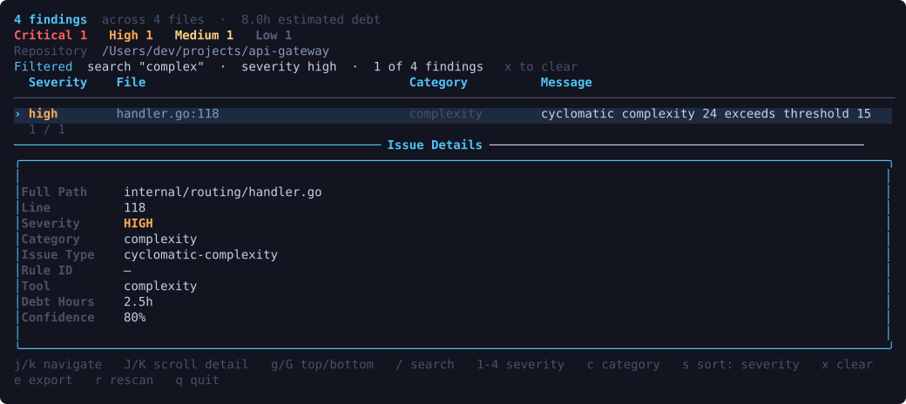
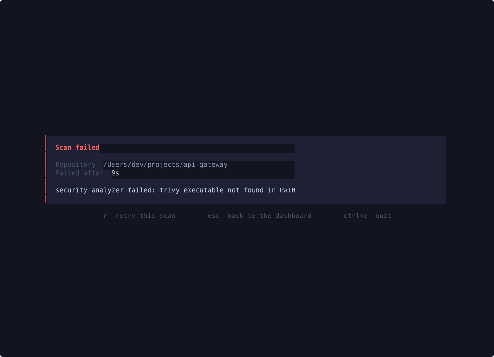
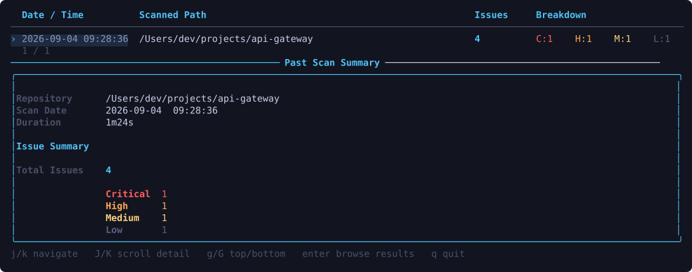
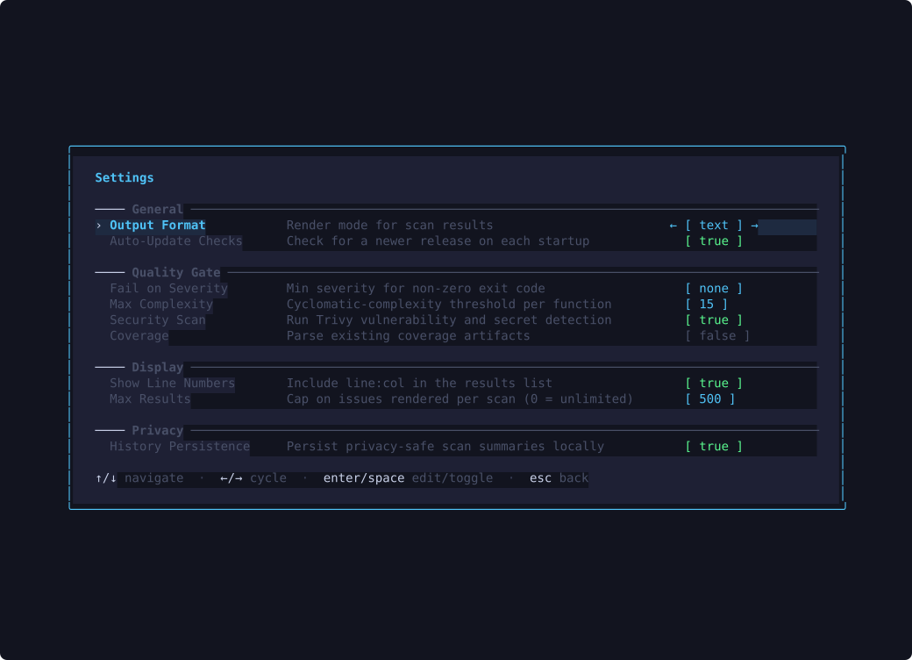

The DebtDrone TUI is a full-screen terminal application built with [Bubble Tea v2](https://github.com/charmbracelet/bubbletea) and styled with [Lipgloss](https://github.com/charmbracelet/lipgloss). It is designed for the exploratory half of the workflow: understanding a codebase, spotting trends across scan history, and adjusting analysis settings — all without leaving the terminal.

This guide covers interactive slash commands. Headless commands and flags are
listed separately in the [command reference](../command-reference/).

---

## Launching the TUI

Type `debtdrone` with no arguments:

```bash
debtdrone
```

The application opens to a keyboard-first dashboard. Its **Primary actions**
panel makes scanning, path selection, session history, settings, help, and quit
available without memorizing commands. The **Recent scans** panel loads the
three newest summaries from DebtDrone's shared local history store.

:::note[Directory context]
`/scan` targets the directory from which the TUI was launched by default. You
can provide another directory as `/scan <path>`.
:::

---

## Navigation

DebtDrone uses familiar Vim-style keybindings throughout every view.

| Key | Action |
|---|---|
| `j` / `↓` | Move selection down |
| `k` / `↑` | Move selection up |
| `Enter` | Confirm selection / drill into detail |
| `Esc` / `q` | Return to the dashboard from a completed child view |
| `Tab` | Move dashboard focus or cycle command-palette completions |
| `Ctrl+C` | Exit the application from any view |

Individual views add keys such as `g`/`G`, page navigation, results filtering,
and configuration editing. During an active scan, navigation keys are ignored
and only cancellation is accepted: `Esc` stops the scan and returns to the
dashboard, `Ctrl+C` stops it and exits.

---

## The Dashboard

Use `j`/`k`, the arrow keys, or `Tab` to move through the visible rows, then
press `Enter` to open the focused action. Returning from another view restores
the previous dashboard focus and refreshes recent history.

| Action | Shortcut | Result |
|---|---|---|
| Scan current directory | `s` | Start a scan of the directory where DebtDrone launched |
| Choose repository path | `p` | Open the command palette with `/scan ` ready for a path |
| Session scan history | `h` | Browse full findings retained during this TUI process |
| Settings | `c` | Open the session settings editor |
| Keyboard help | `?` | Show dashboard shortcuts and slash commands |
| Quit DebtDrone | `q` | Exit to the shell |
| Newest recent scan | `r` | Reopen its persisted summary |

Recent rows show the privacy-safe repository name, completion time, outcome,
finding count, and critical/high/medium/low breakdown. Press `Enter` on any
recent row to reopen its summary. Source code and full finding details are not
persisted, so those remain available only from session history.


*The dashboard. Primary actions sit beside the newest local scan summaries, each row showing its outcome and severity breakdown.*

The empty state points first-time users to **Scan current directory**. If local
history cannot be read, the dashboard shows the error while leaving all primary
actions available.

## The Command Palette

Press `/` from the dashboard to open the command palette. It offers
tab-completion and shows a description of each command as you navigate. Press
`Esc` to return to the dashboard.

Available commands:

| Command | Description |
|---|---|
| `/scan [path]` | Analyze the supplied directory, or the current directory when omitted |
| `/history` | Browse scans completed in the current TUI session |
| `/config` | Open the interactive settings editor |
| `/update` | Check for a new DebtDrone release |
| `/help` | Show the full keybindings reference |
| `/quit` | Exit the application |

---

## `/scan` — Analyzing Your Codebase

```text
/scan [path]
```

Omit `path` to scan the directory from which DebtDrone was launched. After you
type `/scan `, the command palette suggests matching directories and `Tab` accepts
a suggestion. Pressing `Enter` triggers the analysis engine and transitions
the view through two phases:

### Phase 1 — Scanning

The scan runs outside the interface's update loop, so the panel keeps redrawing
and stays responsive for the whole run.

A focused progress panel appears at the center of the screen showing the stage
(the analyzer currently running), the path being processed, and the elapsed
time. Once the scanner reports how many analyzers the run contains, a bar tracks
how many have **finished** — it counts completed analyzers rather than
estimating a percentage, so it never claims progress the scan has not made.
Before that total is known, the panel shows the stage and elapsed time alone.


*The scan progress panel mid-run. The stage, elapsed time, and completed-analyzer count update as the scan advances.*

| Key | Action |
|---|---|
| `Esc` / `q` | Cancel the scan and return to the dashboard |
| `Ctrl+C` | Cancel the scan and exit DebtDrone |

Cancelling stops the scanner itself rather than only hiding its output, and a
cancelled scan can never deliver results afterwards. Starting another scan while
one is running cancels the first — the newer scan owns the view, and the
superseded run cannot overwrite it.

:::tip[What gets scanned?]
DebtDrone analyzes 14 languages: Go, JavaScript, TypeScript (including JSX/TSX), Python, Java, C#, PHP, Ruby, Rust, Kotlin, Swift, C, and C++. Files in `node_modules`, `vendor`, `dist`, and `.git` are excluded by default.
:::

### Phase 2 — Results workspace

Once scanning completes, the view expands into a results workspace.

- **Summary band:** Total findings, the files they touch, estimated debt hours,
  and the critical/high/medium/low breakdown for the complete scan, even when
  `ui.max_results` limits the rows rendered below it. It is always on screen, so
  the headline numbers never require navigation.
- **Findings table (Master):** A scrollable list colour-coded by severity
  (`critical` in red, `high` in orange, `medium` in yellow, `low` in blue),
  initially ordered most severe first. A category column appears on wider
  terminals.
- **Detail pane:** The selected finding's path and location, severity, category,
  type, analyzer, confidence, debt hours, and message. Additional details,
  evidence, and surrounding context appear when the analyzer provides them.


*The results view. The summary band reports the whole scan, the table lists findings by severity, and the detail pane shows the analyzer metadata for the selected finding.*

#### Filtering, searching, and sorting

Search, severity, and category filters combine — each one narrows what the
others left. The status line names every active filter and how many findings
survive them.

| Key | Action |
|---|---|
| `/` | Search findings; results narrow as you type. `Enter` keeps the query, `Esc` restores the previous one |
| `1` `2` `3` `4` | Toggle the critical, high, medium, and low severities. Turning the last one off shows every severity again |
| `c` | Cycle the category filter through each category present, then back to all |
| `s` | Cycle the sort order: severity, file, debt hours, category |
| `x` | Clear search, severity, and category filters. The sort order is a display preference and is kept |
| `e` | Export the findings currently in view to a private, uniquely named JSON file in the working directory |
| `r` | Scan the same repository again using the current configuration |
| `j` / `k` | Move through findings |
| `J` / `K` | Scroll the detail pane |
| `g` / `G` | Jump to the first or last finding |
| `pgup` / `pgdn` | Page through the table |


*Filtered results. The status line names every active filter and how many findings survive them.*

The selected sort mode is the primary order; severity, file, and line provide
stable tie-breaking. Switch back to severity sort to restore the
critical-to-low order. When a filter change keeps the selected finding, the
cursor follows it to its new row; when a filter excludes it, the cursor holds
its position rather than jumping back to the top.

If filters exclude everything, the workspace says which filters are active and
how to clear them instead of showing an empty table. A scan that finds nothing
reports a clean result along with the repository it covered.

#### When a scan fails

A scan that cannot complete reports the repository it targeted, how long it ran
before failing, and the scanner's own error text, so the failure can be acted on
without rerunning it blind. Press `r` to retry the same repository with your
current configuration, or `Esc` to return to the dashboard.


*A failed scan. The repository, the time it ran, and the scanner's own error are all preserved for the retry.*

A scan that partially succeeds still shows its findings, with a **Partial scan**
banner naming the analyzers that failed above the results.

:::note[Raw JSON output]
When **Output Format** is set to `json`, the results view shows the raw report as
a scrollable document. Filtering, sorting, and search apply to the findings
table and are unavailable in that mode.
:::

Press `Esc` to return to the dashboard. Completed results are added to the
current TUI session's history. A privacy-conscious summary is also written to
the bounded local store, but full finding details are discarded when DebtDrone
exits.

---

## `/history` — Browsing Past Scans

```
/history
```

The history view lists scans completed during the current TUI session, newest
first. The header bar shows each entry's timestamp, scanned path, total issue
count, and a severity breakdown (`C` / `H` / `M` / `L`). Selecting an entry
opens a **Past Scan Summary** panel before you drill further.


*The history browser. The selected entry shows its totals and severity breakdown. Press `Enter` to open the full results view for that run.*

Select any entry with `Enter` to open it in the same master-detail layout used
by the live scan view.

:::tip[Spotting trends]
Run a scan before and after a local refactor, then inspect each result from
`/history`. The current browser opens one result at a time and does not reload
persisted summaries or full results across TUI restarts.
:::

---

## `/config` — Interactive Settings Editor

```
/config
```

The config view presents resolved settings as a navigable form, organised into
**General**, **Quality Gate**, **Display**, and **Privacy** sections. Values begin
with the same file and environment precedence used by headless and MCP scans.
Edits become session overrides for scans started in the current TUI.


*The Settings editor. Navigate with `j`/`k`, cycle enum values with `←`/`→`, and toggle booleans with `Enter` or `Space`.*

| Section | Setting | Description |
|---|---|---|
| **General** | Output Format | `text` or `json` for TUI result presentation |
| **General** | Auto-Update Checks | The resolved launch value controls the automatic startup check; changing it after launch does not rerun the check |
| **Quality Gate** | Fail on Severity | Shared value for headless quality gates; TUI scans do not return process-level quality-gate failures |
| **Quality Gate** | Max Complexity | High cyclomatic complexity threshold per function; critical starts above twice the value (default: `15`) |
| **Quality Gate** | Security Scan | Run Trivy vulnerability and secret detection |
| **Quality Gate** | Coverage | Parse existing coverage artifacts without running repository tests |
| **Display** | Show Line Numbers | Include or hide line and column information in rendered results |
| **Display** | Max Results | Cap findings rendered in the TUI; `0` is unlimited |
| **Privacy** | History Persistence | Write or skip new privacy-safe local scan summaries |

### Editing a Value

1. Navigate to the setting with `j`/`k`.
2. Press `Enter` to enter edit mode.
3. For **boolean** settings, `Enter` or `Space` toggles the value directly.
4. For **enum** settings (like Output Format), use `←`/`→` to cycle through valid values and `Enter` to confirm.
5. For **integer** settings, type the new value and press `Enter`.
6. Press `Esc` to cancel an edit without saving.

Changes remain in memory for the current TUI process. They are not written to
the user config file or `.debtdrone.yaml` and are discarded when DebtDrone
exits. Use `debtdrone config set <key> <value>` to persist a setting.

---

## `/update` — Self-Updater

```
/update
```

The update view connects to the GitHub Releases API, compares the current binary version against the latest published release, and presents the result.

- If you are **up to date**, a confirmation message is shown.
- If a **new version is available**, the release notes and changelog are displayed inline. Press `Enter` to download and apply the update in-place. The binary replaces itself and the new version is active on the next launch.

:::caution[Permissions]
The updater writes to the same path as the running binary. If DebtDrone was installed in a system directory (e.g., `/usr/local/bin`), you may need to run it with `sudo` or reinstall via Homebrew to apply updates.
:::
